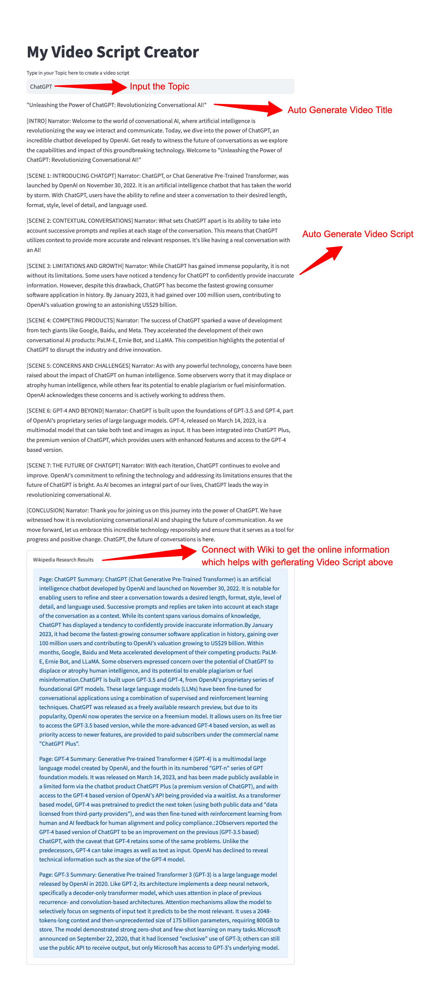

# Auto GPT: Video Script Creator

This is an Auto GPT APP, especially for creating video script automatically.
All you need to do is to input the **Topic**.



## How to use

### Step 1: Install the requirements

```shell
pip install -r requirements.txt
```

### Step 2: Put your OpenAI API key in `apikey-template.py`, and rename it to `apikey.py`

### Step 3: Run the app script

```shell
streamlit run app.py
```

### Step 4: Input the topic of the video you want to create the script for
